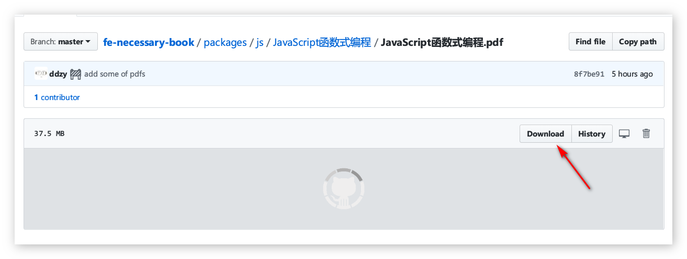

# fe-necessary-book

前端开发者必读的精品pdf集合(小声逼逼: 附精品[开发工具](#开发工具))

## 前言

> 书不在多, 读了才灵

些许资源以链接形式给出, **pdf**大多数为网上搜集而来, 少许部分为自行创作.

如果侵犯到作者的利益, 请联系我删除(`WeChat: dzy13538391627`).

## 目录

- [码农长寿指南](#Healthy)
- [HTTP](#HTTP)
- [JS](#JS)
- [CSS](#CSS)
- [Node](#Node)
- [Database](#Database)
- [第三方JS类库](#第三方JS类库)
- [计算机原理](#计算机原理)
- [大厂前端博客](#大厂前端博客)
- [开发工具](#开发工具)

## Healthy

| Name                                | Link                                                                 |
| ----------------------------------- | -------------------------------------------------------------------- |
| 码农脱单秘笈                        | [Download](./packages/healthy/脱单秘笈)                              |
| 超负荷的大脑-信息过载与工作记忆极限 | [Download](./packages/healthy/超负荷的大脑-信息过载与工作记忆的极限) |
| 临床诊疗指南-眼科学                 | [Download](./packages/healthy/临床诊疗指南-眼科学)                   |
| 防脱发指南                          | [Download](./packages/healthy/防脱发指南)                            |
| 颈椎康复指南                        | [Download](./packages/healthy/颈椎康复指南)                          |
| 啤酒肚科学减脂                      | [Download](./packages/healthy/啤酒肚科学减脂)                        |
| 心理强大之路                        | [Download](./packages/healthy/心理强大之路)                          |
| 活着                                | [Download](./packages/healthy/活着)                                  |

## HTTP

| Name         | Link                                     |
| ------------ | ---------------------------------------- |
| HTTP权威指南 | [Download](./packages/http/HTTP权威指南) |
| 图解HTTP     | [Download](./packages/http/图解HTTP)     |

## JS

| Name                         | Link                                                   |
| ---------------------------- | ------------------------------------------------------ |
| JavaScript高级程序设计第3版  | [Download](./packages/js/JavaScript高级程序设计第3版)  |
| JavaScript权威指南第6版      | [Download](./packages/js/JavaScript权威指南第6版)      |
| 你不知道的Javascript - (上)  | [Download](./packages/js/你不知道的Javascript系列)     |
| 你不知道的Javascript - (中)  | [Download](./packages/js/你不知道的Javascript系列)     |
| 你不知道的Javascript - (下)  | [Download](./packages/js/你不知道的Javascript系列)     |
| 高性能JavaScript             | [Download](./packages/js/高性能JavaScript)             |
| es6标准入门                  | [Download](./packages/js/es6标准入门)                  |
| 学习JavaScript数据结构与算法 | [Download](./packages/js/学习JavaScript数据结构与算法) |
| JavaScript函数式编程         | [Download](./packages/js/JavaScript函数式编程)         |
| JavaScript设计模式           | [Download](./packages/js/JavaScript设计模式)           |
| JavaScript设计模式与开发实践 | [Download](./packages/js/JavaScript设计模式与开发实践) |
| JAVASCRIPT语言精髓与编程实践 | [Download](./packages/js/JAVASCRIPT语言精髓与编程实践) |

## CSS

| Name         | Link                                    |
| ------------ | --------------------------------------- |
| CSS揭秘      | [Download](./packages/css/CSS揭秘)      |
| CSS3权威指南 | [Download](./packages/css/CSS3权威指南) |

## Node

| Name                           | Link                                                       |
| ------------------------------ | ---------------------------------------------------------- |
| Node.js开发指南                | [Download](./packages/node/Node.js开发指南)                |
| Node.js实战                    | [Download](./packages/node/Node.js实战)                    |
| 一个全栈增长工程师的练手项目集 | [Download](./packages/node/一个全栈增长工程师的练手项目集) |

## Database

| Name            | Link                                            |
| --------------- | ----------------------------------------------- |
| 深入学习MongoDB | [Download](./packages/database/深入学习MongoDB) |

## 第三方JS类库

| Name         | Link                                   |
| ------------ | -------------------------------------- |
| 深入浅出Rxjs | [Download](./packages/js/深入浅出Rxjs) |

## 计算机原理

| Name                               | Link                                                              |
| ---------------------------------- | ----------------------------------------------------------------- |
| 计算机的本质: 深入剖析程序和计算机 | [Download](./packages/computer/计算机的本质_深入剖析程序和计算机) |

## 大厂前端博客

| Name                           | Link                                       |
| ------------------------------ | ------------------------------------------ |
| 淘宝前端团队(`TaobaoFED`)      | [链接](http://taobaofed.org/)              |
| 百度云技术团队(`FEX`)          | [链接](https://fex.baidu.com/)             |
| 百度用户体验中心(`MUX`)        | [链接](http://mux.baidu.com/)              |
| 百度(`EFE`)                    | [链接](https://efe.baidu.com/)             |
| 百度(`EUX`)                    | [链接](http://eux.baidu.com/)              |
| 腾讯全端团队(`AlloyTeam`)      | [链接](http://www.alloyteam.com/)          |
| 腾讯IMWeb前端团队(`IMWeb`)     | [链接](https://imweb.io/)                  |
| 360前端团队(`奇舞团`)          | [链接](https://75team.com/)                |
| 凹凸实验室(`Aotu`)             | [链接](https://aotu.io/)                   |
| 去哪儿网大前端技术中心(`YMFE`) | [链接](https://ymfe.org/)                  |
| 京东设计中心(`JDC`)            | [链接](http://jdc.jd.com/)                 |
| 饿了么前端(`ElemeFE`)          | [链接](https://zhuanlan.zhihu.com/ElemeFE) |
| 携程设计委员会(`CDC`)          | [链接](http://ued.ctrip.com/)              |

## 开发工具

| Name            | Description                                                                               | Link                                 |
| --------------- | ----------------------------------------------------------------------------------------- | ------------------------------------ |
| Kindle          | Win10下绝佳的PDF阅读器                                                                    | [Download](./software/kindle)        |
| VS Code         | 四种不同类型的vscode(`已绝版`)                                                            | [Download](./software/vscode)        |
| CentBrowser     | Win10下Chrome的完美替代品, `内置手势`和支持`关闭DirectWrite`                              | [Download](./software/centBrowser)   |
| MacType         | 字体渲染器, 让你的`Win`具有和`Mac`聘美的字体显示效果                                      | [Download](./software/macType)       |
| Microsoft To-Do | 巨硬出品的简约风`Todo`管理软件, `Win10`、`iPhone`、`安卓`无缝同步, 享受被计划支配的感觉吧 | [Download](./software/microsoftToDo) |
| Wireshark       | web开发者必备的`抓包`工具                                                                 | [Download](./software/wireshark)     |

## 如何下载?

## CHANGELOG

@see: [CHANGELOG.md](./CHANGELOG.md)

## LICENSE

@see: [MIT](./LICENSE)