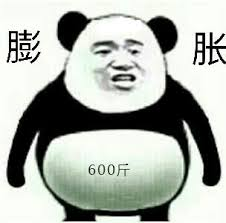

# 啤酒肚科学减脂

## 前言

> 本书部分内容摘录自网上, 项目owner倾情打造(`唉, 你也在网上冲浪啊`)

啤酒肚, 想必是大多数人, 特别是男人, 再比如特殊群体——程序员的`必备`. 那么, 本书将会从以下三个方面来展开讨论:

- 啤酒肚是什么?
- 啤酒肚有什么危害?
- 如何抵制啤酒肚?

## 一、何为啤酒肚?

> 啤酒肚是第三方原因导致的腹部肥胖

### 1.1 形成原因

除了腹胀、腹水这些病理性原因外, 啤酒肚形成的主要原因有以下几点:

- 缺乏运动、饮食无节制导致脂肪堆积腹部;
- 日常压力导致自主神经系统失衡、睡眠质量差;
- 坐姿、站姿不正确导致身体中心偏移、肌肉失衡、下腹突出, 导致排毒不顺畅, 肠胃蠕动功能减弱, 诱因**腹部鼓胀**.

### 1.2 患病人群

男人居多, 特别是我们这些`码农`

## 二、啤酒肚的危害?

啤酒肚, 不仅影响外在形象, 想象一下, 整天挺着个大肚子, 是怀孕了还是怎么着? 而且对于健康的威胁也相当大, 可能会诱发一系列疾病——高血压、高脂血症、大脑动脉粥样硬化、脂肪肝、骨关节...等等

## 三、如何防治?

既然有这个病, 那么相应的就有对应的诊治方法.

### 3.1 心态方面

日常保持良好的心态, 对于啤酒肚不要置之不理, 在当前`996工作制`的大背景下, 如何协调工作、生活、健康, 是每个人都必须面对的. 特别是我们码农, **赚钱赚钱, 命都没了, 赚什么钱**? 所以就更需要打理我们的身体健康.

### 3.2 饮食方面

#### 3.2.1 一日三餐要必备

**早餐**必须要吃, 关系到一整天的工作状态.

**午餐**可以适量吃一些肉之类的

**晚餐**多吃蔬菜, 饭量要少

#### 3.2.2 热水要必备

> 马上520了, 送点什么礼物给女神呢? 对了, 叫她多喝热水试试...

在办公桌上晾一杯白开水, 强迫自己多喝一些, 那些什么果汁之类的, 偶尔喝喝也没什么不好.

#### 3.2.3 控制酒量

酒精含能量较高, 它可阻止体脂的消耗, 还降低意志力. 如果你想饮些酒, 最好与汽水混起来喝. 多喝水和低能量饮料.

### 3.3 作息方面

> 码农: 我也想早点睡, 可是要加班啊...

大环境下, 谁让咋选了这一行呢, 尽量控制自己早些睡觉吧~

### 3.4 运动方面

- 晚饭过后可以做几个俯卧称、引体向上
- 跑跑步也是可以的, 隔两三天来个`五公里`操场跑, 不信小肚腩减不掉?
- 坚持在`Keep`打卡

### 3.5 生活方面

- 日常保持**坐姿标准**, 不论你在办公室还是在家, 毕竟码农, 一天十几个小时久坐电脑前.
- 少玩手机
- 找个女朋友, 做做运动, 也是不错的选择~