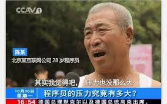
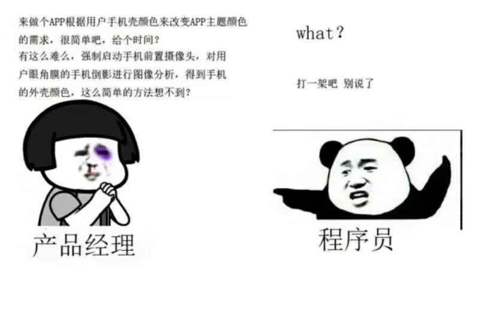

# 防脱发指南

## 前言

> 本书部分内容摘录自网上, 项目owner倾情打造(`唉, 你也在网上冲浪啊`)

作为新时代的特色码农, 你是否热爱编程? 又是否整日沉迷代码? 再或者梦想成为一个技术大牛? 醒醒吧孩子, 你的头发掉光了...

## 一、为何脱发?

先看看各大论坛对于程序员脱发的讨论吧:

- [知乎-优秀的程序员是没有头发的](https://zhuanlan.zhihu.com/p/32144969)
- [知乎-当程序员真的会掉头发吗?](https://www.zhihu.com/question/275770504)
- [CSDN-程序员为什么更容易掉头发?](https://blog.csdn.net/GitChat/article/details/80754879)
- [V2EX-程序员秃顶的多吗?](https://www.v2ex.com/t/75928)

似乎码农的脱发、秃顶已经成为了一个老生常谈的问题, `地中海`、`拿钱多, 活不过30岁`彷佛已经成为了码农的代名词. 那么, 是什么原因导致了码农们的脱发问题呢?

### 1.1 大量的脑力运动

从事脑力劳动的人更容易脱发, 俗话说的好——**聪明绝顶**, 现在看来还是有一定道理的. 看看当代的科学大佬, 哪一个不是`地中海`?

大量的脑力劳作, 导致血液循环加速, 大脑需要的能量增多, 相应的, 对于皮肤、毛发之类的血液供给就会减弱, 进而导致头发的生长周期被打乱, 出现**发量稀疏**、**毛发脱落**等问题.

### 1.2 不规律作息

长期熬夜对于身体的残害是最深的, 掉发会明显增多, 而现在处于996的大环境下, 码农们也是身不由己啊.

### 1.3 不健康饮食

"今天多睡一会儿, 不吃早餐了"、

"中午那么热, 点个外卖吧"、

"好久没吃烧烤了, 来肝一波?"

等等这些因素, 会对码农的饮食习惯产生重大影响. 人体的能量代谢需要大量的维生素B组, 血液输氧则需要充足的铁元素, 一般码农最缺乏这两类东西, 如果吃饭不讲究, 比如经常吃泡面这类速成品的人, 还容易缺乏蛋白质, 更是雪上加霜.

### 1.4 精神压力大

做不完的需求, 随时变化的需求, 难以实现的需求, 都是导致码农精神压力大的主要原因

### 1.5 产品经理

一图胜千言:

### 1.6 单身

大多数程序员因为工作问题, 都处于单身的状态, 有很多年龄比较大的程序员仍未婚.

可能有人会问, 这个跟脱不脱发友什么关系? 这还真的有问题, 哈佛大学就曾有一个非正式的研究, 结果显示已婚男子的体内雄激素明显低于未婚男子, 雄激素是雄性脱发的一个重要影响因素, 所以有稳定性伴侣的人士体内雄激素更趋向于偏低和稳定, 也就是更容易保护好自己的头发. --*摘自知乎*

## 二、预防之术?

既然脱发这么可啪, 那么如何去预防它呢(--摘自[程序员大本营](http://www.pianshen.com/article/3966161785/))?

1. 远离秃顶可以多吃低脂乳制品. 钙是头发生长必须的物质, 我们的身体无时不刻都在生长, 要注意保持均衡饮食, 补充人体所需的各种营养物质, 脱脂牛奶和酸奶都是低脂的乳制品, 多喝可以补充钙、乳清和酪蛋白. 建议出门的时候带上一盒, 营养美味, 补充能量, 远离秃顶.

2. 远离秃顶可以多吃坚果. 坚果是大家比较喜爱的零食, 它富含锌和硒, 可以促进头发的健康生长. 在闲暇时, 多吃坚果, 不仅补充能量和营养, 同时也可以愉悦心情.

3. 多吃碱性的新鲜蔬菜和水果可以远离秃顶. 用脑过度, 头部的血液就会相对减少, 长期下去容易产生脱发的现象, 特别是男性, 很多都是从事脑力工作, 比女性更容易脱发, 掉发. 引起脱发的因素之一是血液中含有酸性的毒素, 这时应该多吃碱性的水果和蔬菜, 这样会使脱发的现象大大改善.

4. 适当补充维生素E能有效避免脱发, 远离秃顶. 维生素E可以抗毛发衰老, 促进细胞的新陈代谢, 是促进毛发生长的重要物质. 在日常生活中, 我们可以通过吃新鲜的莴苣、黑芝麻以及卷心菜来补充维生素E, 减少头发的脱落, 促进秀发的健康生长.

5. 远离秃顶可以多吃含铁的食物. 研究表明, 很多脱发的人都是体内缺铁, 铁是人体中重要的物质之一, 缺铁还会引起贫血. 建议多吃黄豆、鸡蛋、虾、菠菜、香蕉等等来补充铁, 这些食物铁质含量丰富, 能有效治疗脱发现象, 还你乌黑秀发.

6. 补充含碘的食物可以远离秃顶. 碘含量高的食物有紫菜、海带和牡蛎, 头发的光泽和甲状腺的作用有密切的关联. 补充碘可以促进甲状腺的分泌功能, 使秀发变得乌黑有光泽, 不再分叉枯燥

## 三、如何诊治?

如果你已经**地中海**了, 那么: "亲, 这边建议您购买`生发剂`或者`戴假发`呢."