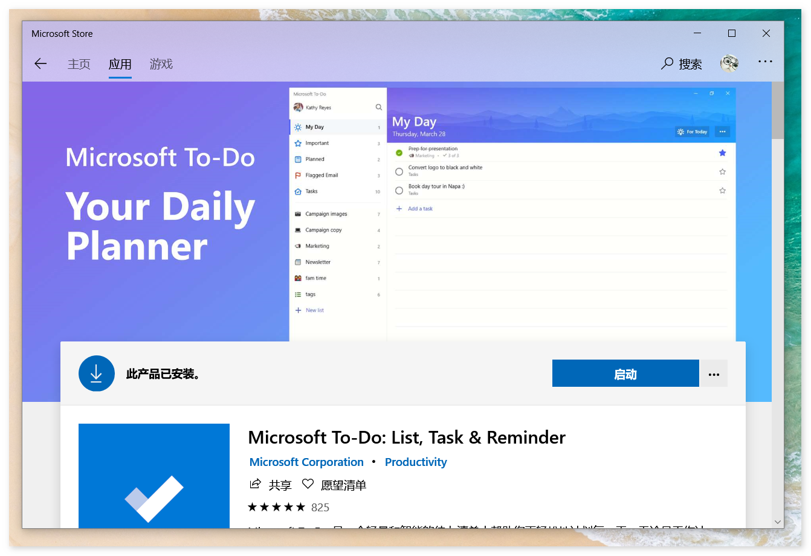
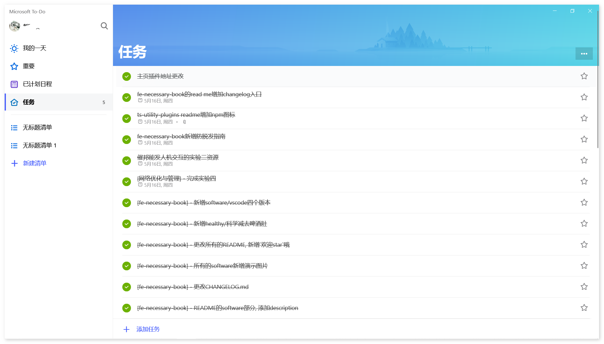
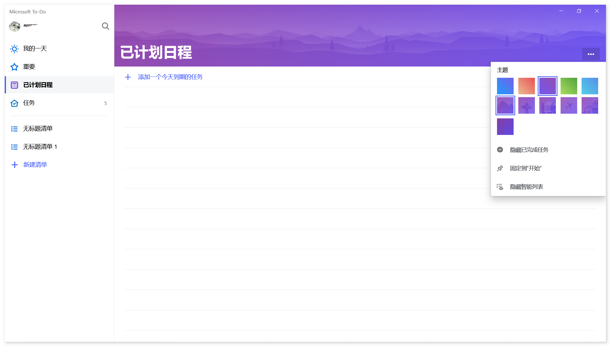
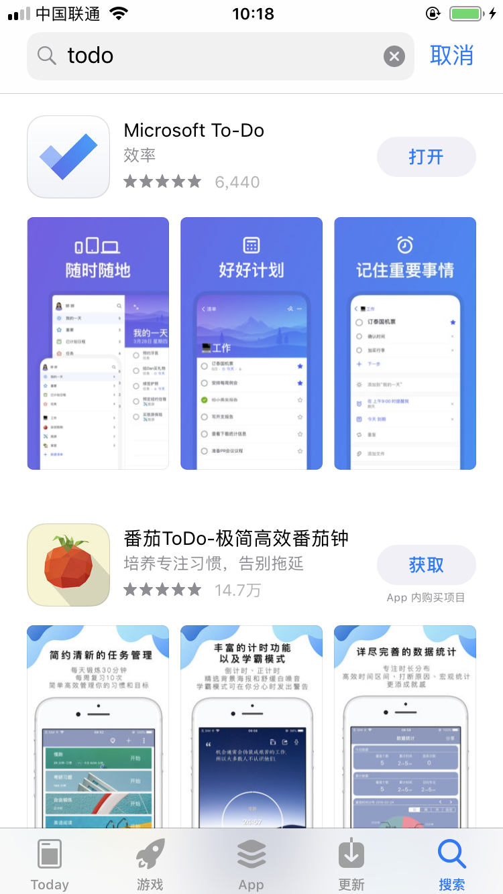
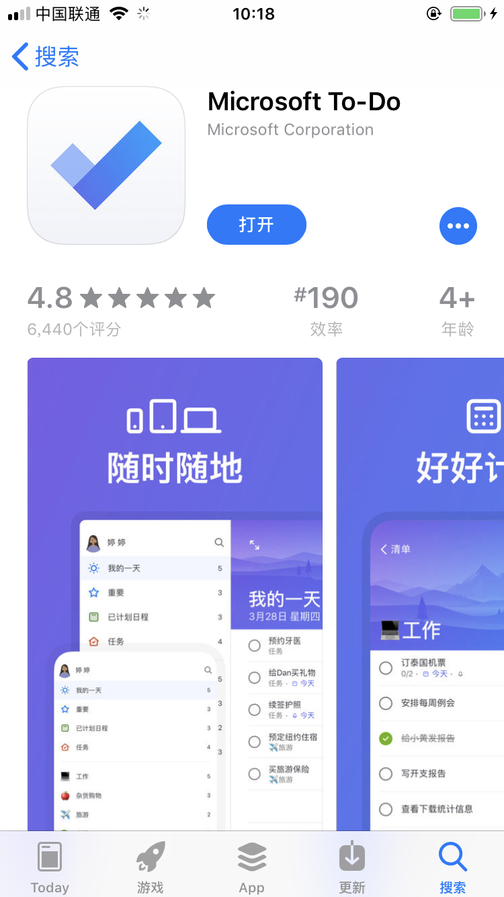

# Microsoft To-Do

## 介绍

> **2019/6/25** 更新, `Microsoft To-Do`现已支持`Mac`!

看到名字, 都知道是啥了吧, 没错, 巨硬出品的`ToDo`管理软件:

- 界面简洁
- 可自由更换主题
- 极简风, 无冗余功能
- 支持`iPhone`、`Win10`、`安卓`无缝同步
- 全平台无缝同步

有了这款高颜值且实用的软件, 完全可以抛弃第三方TODO软件(`巨硬出品, 必属精品`).

附上之前发的掘金沸点: [链接](https://juejin.im/pin/5cdcb126e51d456e13da8f72)

## 下载

- [Win10](#Win10)
- [Mac](#Mac)
- [iPhone](#iPhone)
- [Android](#Android)

### Win10

`win10`用户直接在商店中搜索`todo`, 找到`Microsoft To-Do`字样即可

### Mac

直接在`Mac App Store`购买和下载.

**预览地址:**  [https://apps.apple.com/cn/app/microsoft-to-do/id1274495053?mt=12](https://apps.apple.com/cn/app/microsoft-to-do/id1274495053?mt=12)

### iPhone

`iPhone`用户在`AppStore`中输入`to-do`, 同样找到`Microsoft To-Do`

### Android

同上

## 图例

附`Win10`截图展示:

附`iPhone`截图展示:

## 其它

[star](https://github.com/ddzy/fe-necessary-book)一下本项目, 鼓励一下吧~