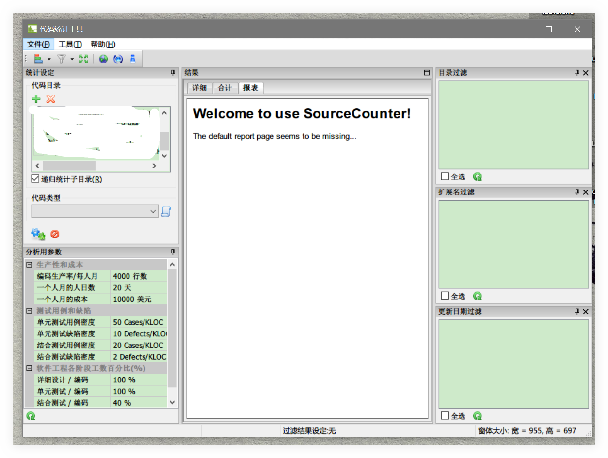
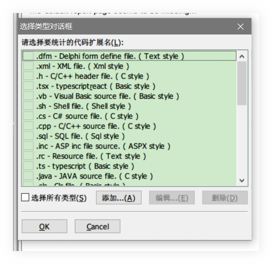
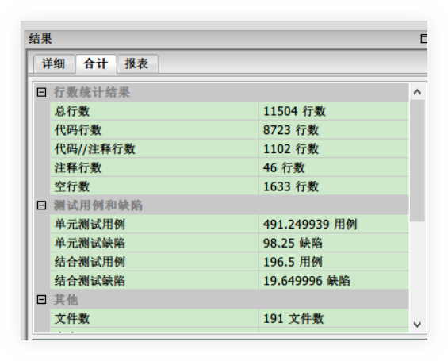

# tSourceCounter

## 说明

> 只提供`Win`平台的

专为码农提供的`代码统计`工具.

可以统计你的代码数量, 可以根据多种形式来统计:

- 文件名(`Filename`)
- 文件后缀(`Suffix`)
- 指定文件夹(`Directory`)

虽说代码量不是衡量一个码农的技术水平的唯一标准,

但是一个合格的码农, 必然经历过万千代码的洗礼.

## 图例

1. 主界面:

2. 根据`文件后缀`统计:

3. 统计结果:

## 其它

[star](https://github.com/ddzy/fe-necessary-book)一下本项目, 鼓励一下吧~