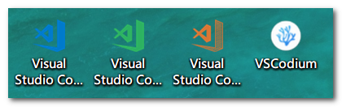
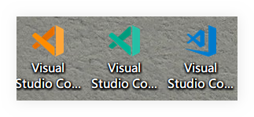

# VSCode

## 说明

> 只提供`Win`平台的~

作为最受欢迎的开发工具, VSCode的使用已然成为了一项必备技能, 是时候拿出我的老本了~

VSCode其实是有`>=4`个版本的:

- VSCode-user
- VSCode-insider
- VSCode-exploration
- VSCodium

它们四者的关系如下表:

| Name               | Description                                              |
| ------------------ | -------------------------------------------------------- |
| vscode-user        | 用户版, 推荐使用的稳定版本                               |
| vscode-insider     | 内部构建版本, 可以体验最新功能                           |
| vscode-exploration | 探索版, 较早的内部版本, 目前我正在使用中~, **已绝版!!!** |
| vscodium           | 最近新出的一款, 外观一毛一样                             |

## 图例

四种VS Code展示:

`2019/6/6`更新: VS Code推出`1.35`预览版本, 更换了更加拟物化的Logo:

## 其它

[star](https://github.com/ddzy/fe-necessary-book)一下本项目, 鼓励一下吧~