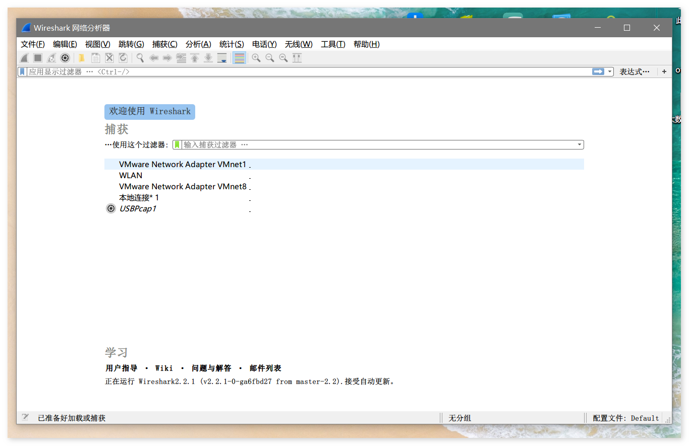
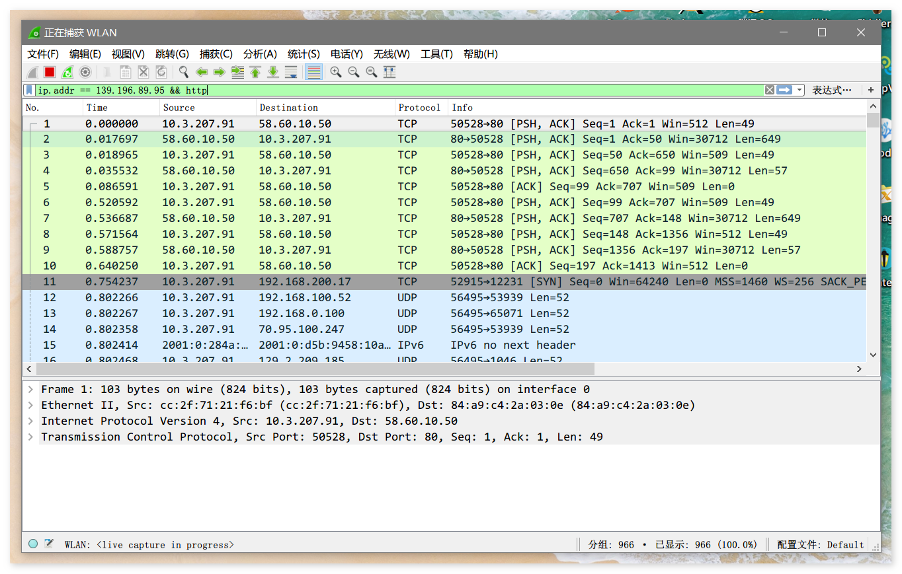

# wireshark

## 前言

虽说现在市面上的**抓包工具**多如牛毛, 从开始的`Fiddler`到现在的`Wireshark`, 给我的感觉是界面变得更加整洁舒适.

作为web开发者, 网络协议的知识万万不可忽略, 因此, 让`wireshark`伴随你的开发生涯吧!

## 图例

主界面展示:

操作界面展示:

## 其它

[star](https://github.com/ddzy/fe-necessary-book)一下本项目, 鼓励一下吧!